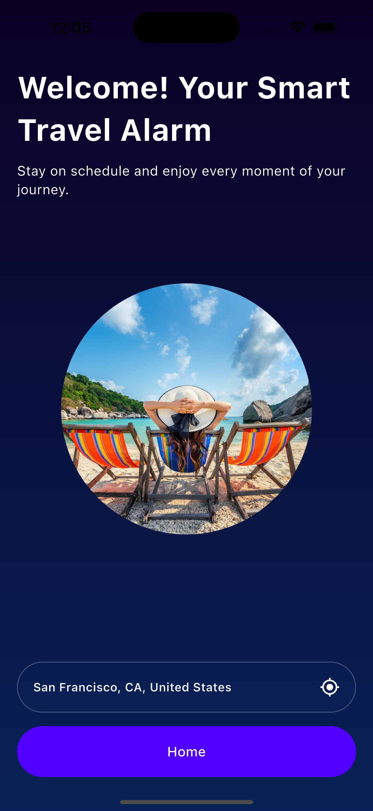
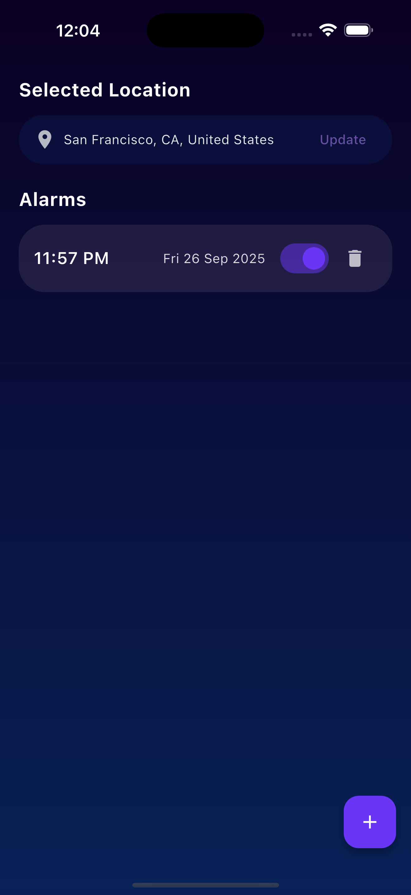

# Smart Travel Alarm ⏰

A Flutter app built as part of the assessment task.  
It includes onboarding screens, location access, and alarm/notification features.

---

## 🚀 Features
- 3 onboarding screens with video backgrounds
- Location permission & display
- Set alarms with date + time picker
- Notifications using `flutter_local_notifications`
- Local storage with `get_storage`

---

## 🛠 Tools & Packages
- Flutter (SDK 3.x)
- [get](https://pub.dev/packages/get) – state management & routing
- [get_storage](https://pub.dev/packages/get_storage) – local storage
- [geolocator](https://pub.dev/packages/geolocator) – location services
- [geocoding](https://pub.dev/packages/geocoding) – reverse geocoding
- [flutter_local_notifications](https://pub.dev/packages/flutter_local_notifications) – notifications
- [timezone](https://pub.dev/packages/timezone) – scheduling alarms
- [video_player](https://pub.dev/packages/video_player) – onboarding videos
- [chewie](https://pub.dev/packages/chewie) – better video control UI

---

## 📱 Screenshots
# My Flutter App

### Onboarding

### Home Page

### Alarm Page

---

## ▶️ Demo Video
Watch here: https://www.loom.com/share/a47541bb26254a44a07f1a9d0d9c0bcc?sid=09bade93-31ac-4bea-a6c7-5b230512df37

---

